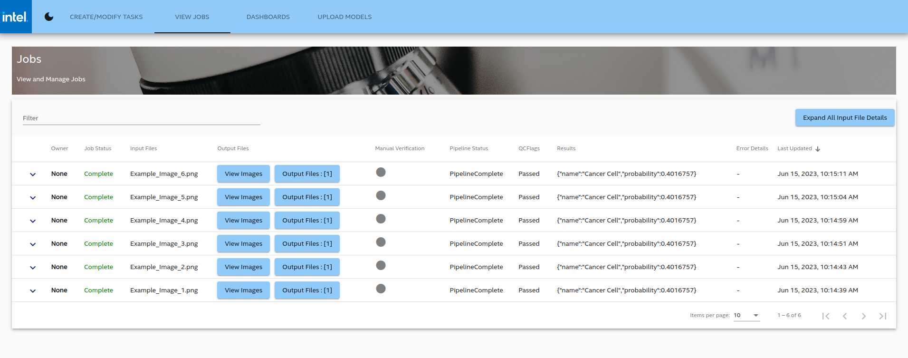

# Get Started Guide

-   **Time to Complete:** 30 minutes
-   **Programming Language:** Go*, Python*, Angular*

## Get Started

A typical setup for the AI Pipeline Connection for Scientific Instrument Data Reference Implementation (or AiCSD) comprises two systems, a Gateway system and an OEM system, communicating with each other via a secure SSH tunnel. Scientific instruments (for example, optical microscopes) are connected to the OEM system and supply the images for processing on the Gateway system.

This guide demonstrates the reference implementation setup on a single system, which runs the services for both OEM and Gateway. Complete this guide to confirm that your setup is working correctly and try out a basic workflow in the reference implementation.

### Prerequisites for Target System

-  Intel® Core™ processor
-  5 GB of memory minimum
-  10 GB of storage space minimum
-  Internet access
-  Ubuntu* 20.04 LTS Desktop or later

> **Note**  
> If Ubuntu Desktop is not installed on the target system, follow the instructions from Ubuntu to [install Ubuntu desktop](https://ubuntu.com/tutorials/install-ubuntu-desktop).

### Step 1: Install the package

Follow this procedure on the target system to install the package.

1. Download the reference implementation package:  
[AI Pipeline Connection for Scientific Instrument Data Reference Implementation](https://edgesoftware.intel.com/ai-connect-for-scientific-data-package)

2. In Terminal, go to the download directory and unzip the package.

         unzip ai-connect-for-scientific-data-package.zip

3. Go to the extracted directory.

         cd ai-connect-for-scientific-data-package/

4. Change the permission of the edgesoftware executable.

         chmod 755 edgesoftware

5. Install the reference implementation.

         ./edgesoftware install

6. When prompted, enter the product key. The product key is in the email you received from Intel after you downloaded the package.

   When the installation is finished, you see the message "Installation of package complete" and the installation status for each module.

   

   Figure 1: Successful installation

   > **Note**  
   > If the Docker* installation fails because of proxy-related issues, follow the [manual docker installation steps](#manual-docker-installation) in the Troubleshooting section.

### Step 2: Build and verify

Follow this procedure to build the containers and run the reference implementation.

> **Note**  
> If you are behind a proxy or running a two-system setup, please modify the GATEWAY_IP_ADDR variable in `AiCSD/Makefile` with your gateway IP address.

1. Go to the reference implementation directory and build Docker containers to run in a single-system setup.

         cd AiCSD
         make docker

> **Note**
> 

2. Run the services.

        make run-sim

3. Verify whether the correct number of containers are running. There are 20 containers for this single-system setup.

        docker ps

   

   Figure 2: List of containers

## Run a Workflow for Remote Monitoring and Image Analysis

The following is the procedure to run a workflow to process an image from the OEM system on a Gateway system. In a typical deployment, the OEM and Gateway are separate systems. For this demonstration, both OEM and Gateway services are on the same system.

### Step 1: Create a task with the pipeline on the Gateway

Follow this procedure to create a task that matches the input image to the pipeline.

1. Launch the Web UI by entering this URL in the browser: http://_target_system_IP_:4200

   > **Note**  
   > You can identify the IP address of your target system using the following command in the Terminal.
   >
   >        hostname -I

2. In the Web UI, select **Add Task** to create a task in the Gateway.

   

   Figure 3: Add task

3. Complete the following fields in the Add Task page:

   

   Figure 4: Task details

    -   **Description:** Provide a description of the task.
    -   **Pipeline:** Select a Model Execution Pipeline.  
 For this example, select **FileAndResults: Pipeline that generates output file and results**.
    -   **Job Selector:** Select **matches** to filter jobs based on filenames that match the value of the **Filename** field, or select **contains** to filter jobs based on filenames that contain the value of the **filename** field.  
For this example, select **contains**.
    -   **Filename:** Provide the file name of the input image.  
For this example, use **Example_Image**. 
    -   **Model Parameters:** Provide the parameter details for the model. The parameters should adhere to the following json format (with quotes):

            {"parameter":"value"}

        For this example, enter the following parameters:

            {"Brightness":"0"}

4. Select **Save** to complete this procedure.

### Step 2: Supply input images from the OEM microscope

Follow this procedure to supply input images.

1. In Terminal, go to the input directory. The system will monitor this directory for files to be processed.

        cd $HOME/data/oem-files/input

2. Copy an image file into this directory. The Gateway will monitor and process any new image files added to this directory. 

   > **Note**  
   > Earlier in [Step 1](#step-1-create-a-task-with-the-pipeline-on-the-gateway), you added a task to monitor the OEM for image files that **contain** the name **Example_Image**. This means the Gateway will monitor and process images with filenames such as Example_Image_1.png and Example_Image_2.png. Other image file types supported are JPG, GIF, and TIFF.

3. Check the output directory for the output file.

        cd $HOME/data/oem-files/output

### Step 3: Monitor the status of the job

Follow this procedure to check the status of the task on the Gateway.

1. In the Web UI, select the **View Jobs** tab to see a list of all jobs.

   

   Figure 5: List of jobs in the View Jobs tab

2. You should see the task you created earlier and its status.

### Step 4: End the demonstration

Follow this procedure to stop the reference implementation and end this demonstration.

1. Stop the reference implementation with the following command.

         make down

2. Confirm the containers are no longer running.

         docker ps

## Summary

In this guide, you installed and validated the reference implementation, with Gateway and OEM services running on a single-system setup. You also completed a basic workflow that demonstrates image processing on the Gateway system using images supplied from an OEM system.

## Learn More

-  Learn how to integrate a custom pipeline with models from Intel® Geti™ platform using the [Pipeline Configuration](./Pipeline-Configuration.md) chapter in the User Guide.

## Troubleshooting

The following are options to help you resolve issues with the reference implementation.

### Manual Docker Installation

If you're behind a proxy, there may be connectivity issues. Use the following steps to install Docker manually:

1. Follow the instructions from Docker to [install Docker Engine from a package](https://docs.docker.com/engine/install/ubuntu/#install-from-a-package).

2. Complete these post-installation steps from Docker to [manage Docker as a non-root user](https://docs.docker.com/engine/install/linux-postinstall/#manage-docker-as-a-non-root-user).

3. Use these methods from Docker to [configure the Docker CLI to use proxies](https://docs.docker.com/engine/cli/proxy/).

### Troubleshooting

Refer to [Troubleshooting](../troubleshooting-tools.md) if you are seeing issues during setup.

### Known Issues

For known issues, see [Issues](https://github.com/intel/AiCSD/issues?q=is%3Aissue+is%3Aopen+label%3A1.1) on GitHub*.

