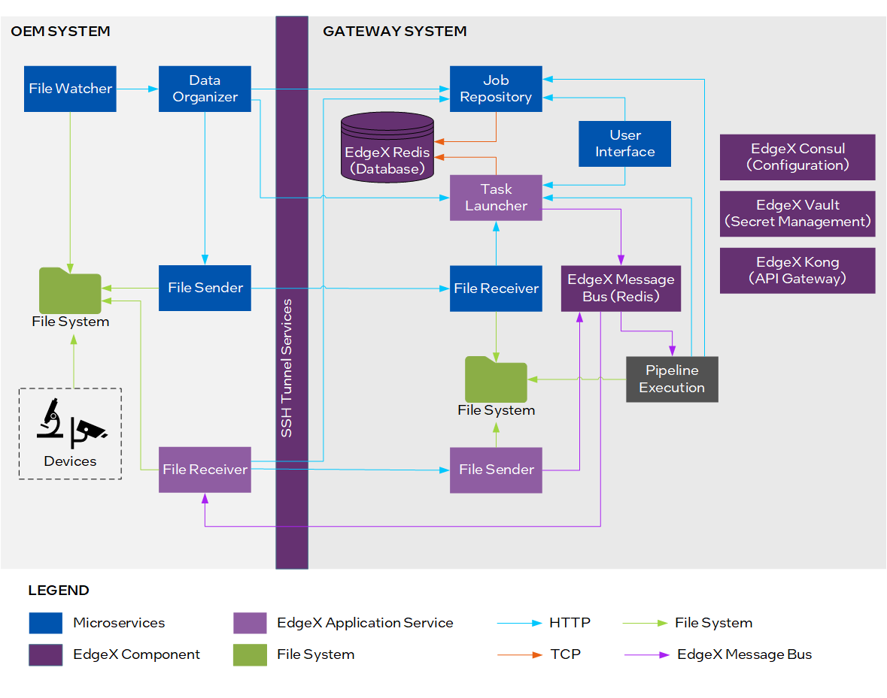
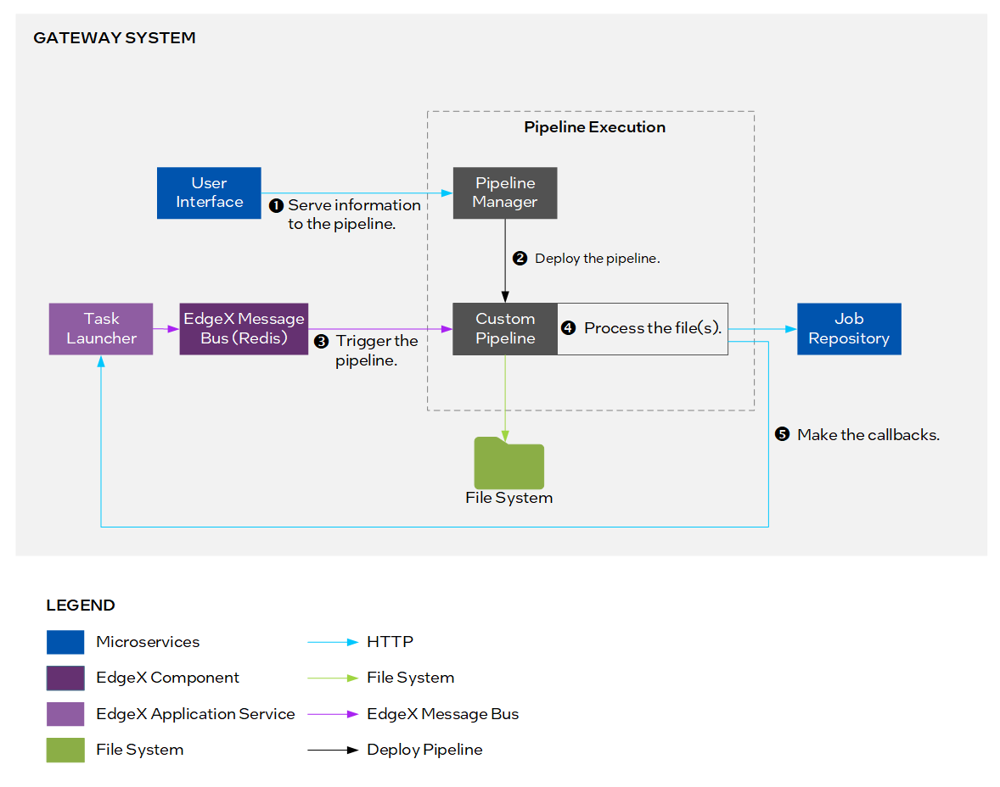

# AI Pipeline Connection for Scientific Instrument Data Reference Implementation

Connect data from scientific instruments to applicable AI pipelines and run workloads at the network edge.

## Overview

Use this reference implementation to connect data from scientific instruments to applicable AI pipelines and run workloads at the network edge. These pipelines are containerized, incorporating all necessary components into a standardized, portable unit suitable for edge devices. This open source reference implementation contains microservices based on EdgeX Foundry* to automatically detect, manage, and process images. Also included is a user interface to manage tasks and jobs.

### Features

The AI Pipeline Connection for Scientific Instrument Data Reference Implementation (or AiCSD) offers the following features:

-   Remote monitoring with near real-time analysis of data at the network edge.
-   AI-assisted cell analysis for greater accuracy of research decisions and outcomes.
-   On-premise data processing for data privacy and efficient use of bandwidth.
-   Integration of OpenVINO™ toolkit and Intel® Geti™ platform models from training to inference at the edge.

## How It Works

The reference implementation manages pipelines for image processing and automated image comparisons for cell analysis. In a typical setup, third-party input devices (for example, optical microscopes) are connected to an OEM system and provide images that will be processed by the Gateway system. The microservices are connected by a secure Redis* message broker and communication APIs.

Figure 1 shows the services used in this reference implementation and the flow of data through the architecture.

Figure 1: Architecture diagram of the reference implementation

For the Pipeline Execution component in the Gateway system, the architecture diagram is shown in Figure 2.

Figure 2: Architecture of the pipeline execution component in the gateway system

This reference implementation is built with this component:

-   <a href="https://edgeservicescatalog.intel.com/details/?microserviceType=recipe&microserviceNameForUrl=edge-video-analytics-microservice">**Edge Video Analytics Microservice (EVAM)**</a> is an interoperable containerized microservice based on Python for video ingestion and deep learning inferencing functions.

Other components in this reference implementation are as follows:

-   **Microservices** are provided by Intel, which include a user interface and applications for managing files and jobs.
-   **EdgeX Application Services** provide the APIs to communicate and transfer information.
-   **EdgeX Services** include the database, message broker, and security services.
-   **Pipeline Execution** supplies an example of an image classification pipeline in this reference implementation.
-   **File System** stores and manages input and output files.
-   **Third-Party Input Devices** supply the images that will be processed. An example of an input device is an optical microscope.

## Learn More

-   Get started with the reference implementation by using the [Get Started Guide](../user-guide/Get-Started-Guide.md).
-  Learn how to integrate a custom pipeline with models from Intel® Geti™ platform using the [Pipeline Configuration](./Pipeline-Configuration.md) chapter in the User Guide.
-   Familiarize with the overall collection of services at a system level by using the [Services Information](./services/general-info.md) chapter in the User Guide.
-   Learn about the open-source tools used for collecting, storing, and displaying data by using the [Monitoring Feature](./monitoring/overview.md) and [Log Analytics](./log-analytics/overview.md) chapters in the User Guide.
-   Understand the security considerations for this reference implementation by using the [Security Considerations](./security/security-docs.md) chapter in the User Guide.
