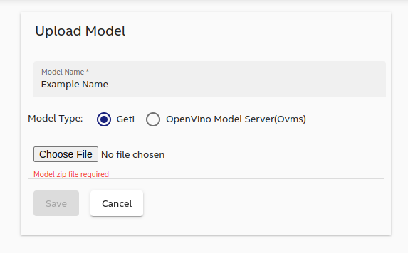
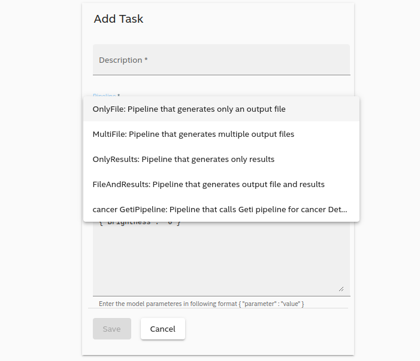

# Pipeline Configuration for Intel® Geti™ Platform Model
## Overview

Deploy Intel® Geti™ platform models on this reference implementation. 

With the Intel® Geti™ platform, you can train your own models for object detection, classification, segmentation, and anomaly. Learn more about [Intel® Geti™ platform](https://geti.intel.com/).

## Step 1: Run the services

Follow this procedure to run the services for pipelines with Intel® Geti™ platform models.

1. Run the services.

        make run-geti

2. Verify whether the correct number of containers are running. There are 23 containers for this pipeline.

        docker ps

## Step 2: Upload your Intel® Geti™ platform model

Once you export the trained model from Intel® Geti™ platform you can upload it via the Web UI or add the model into the file system manually.

**Option 1: Web UI (Recommended)**

1. Launch the Web UI by entering this URL in the browser: http://_target_system_IP_:4200

   > **Note**  
   > You can identify the IP address of your target system using the following command in the Terminal.
   >
   >        hostname -I

2. Select **Upload Models**.

3. Give the model a name, select **Geti** as the model type, and upload the zip file exported from Intel® Geti™ platform using the **Choose File** button. 

4. Select **Save** to proceed with the upload.

**Option 2: Manually Add Models to the File System**

1. Create a subfolder under the **models** folder inside the AiCSD directory on the Gateway system. You can use any name, for example `models/cells`. 

2. Unzip the exported models file from Intel® Geti™ platform and copy the **deployment** folder inside the `models/cells` folder in the AiCSD directory.

## Step 3: Create a task with the pipeline

Follow this procedure to create a task that matches the input image to the deployed model.

1. To create a new task with the new deployed model, go to the task page on the Web UI, and select **Add Task**.

2. Select the model you deployed earlier from the **Pipeline** dropdown list.

## Step 4: Supply input images on the OEM system

Follow this procedure on the OEM system to supply input images.

1. In Terminal on the OEM system, go to the input directory. The system will monitor this directory for files to be processed.

        cd $HOME/data/oem-files/input

2. Copy an image file or a directory of files into this directory. The Gateway will monitor and process any new images added to this directory. 

   > **Note**  
   > Ensure the Job Selector rule from [Step 3](#step-3-create-a-task-with-new-pipeline) matches the filenames you added. Supported image file types are JPG, PNG, GIF, and TIFF.

   **Option 1: Copy Individual Files**  
   To copy an individual file, use the **cp** command in Terminal

   **Option 2: Copy a Directory of Files**  
   To copy a directory of files, use the copy-files make target to copy all files in a directory to the input directory.

         make copy-files COPY_DIR=/path/to/dir

   The default wait time between files being copied to the directory is 30 seconds. Update the SLEEP_TIME variable to change this:

         make copy-files COPY_DIR=/path/to/dir SLEEP_TIME=15

3. Check the output directory on the OEM system for the output file.

        cd $HOME/data/oem-files/output

## Step 5: Check status of the file and its associated job on the Gateway system

> **Note**  
> If the job has successfully processed the images, the status shows Complete. Otherwise the Owner field will show what component is processing the job.

Use one of the following methods on the Gateway system to check the status of the job.

**Method 1:**  
Use the Web UI to monitor the status of the job. For details, see [Job Management](./Web-UI-Guide.md#job-management).

**Method 2:**  
Use the Terminal.

1. Query for all jobs

         curl localhost:59784/api/v1/job | json_pp

2. Search the output for the desired input file name and grab the job ID.

3. Copy the job ID and use it to query for details.

         curl localhost:59784/api/v1/job/<job_id> | json_pp

> **Note**  
> To check the status of the pipeline processing the image, check the logs of the **edgex-pipeline-sim-1** container. For details on checking the logs, see [Check Logs](./Troubleshooting.md#check-logs).
