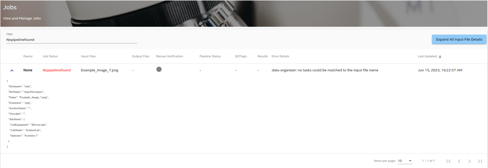
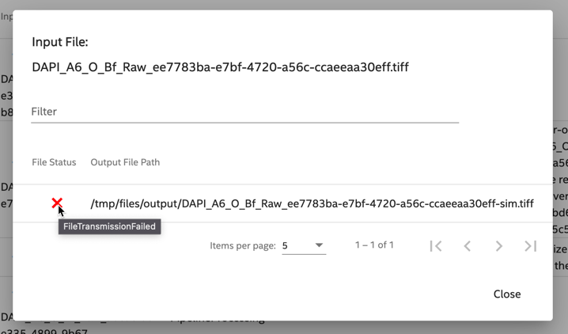
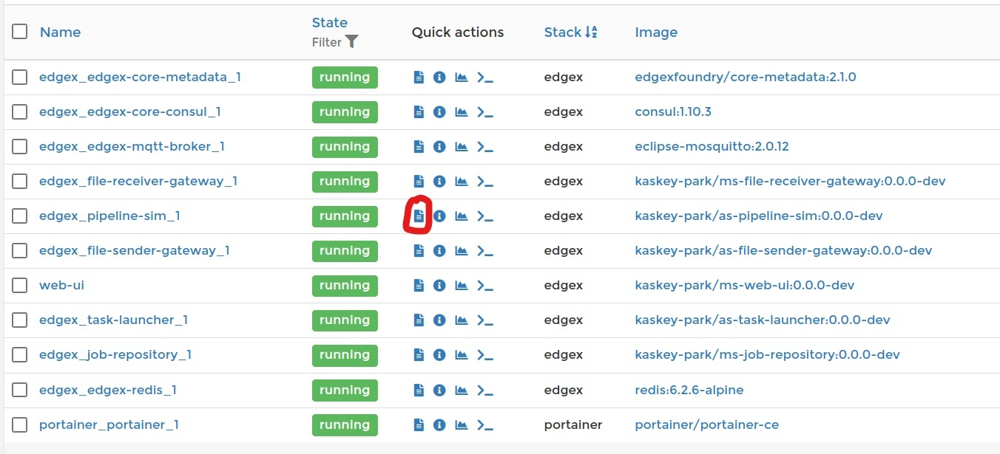

# Troubleshooting

Topics covered in this section:
-  [Microservice Related Issues and Errors](#microservice-related-issues-and-errors)
-  [Monitoring and Logging Related Issues](#monitoring-and-logging-related-issues)

## Microservice Related Issues and Errors
This section contains troubleshooting for common issues and errors.

### Stop Services and Clean Up
The section details how to stop all the software services and clean up the environments.

#### Stop Services on Gateway (or single system)
To stop the services, run

``` bash
make down
```

This will bring down all services that are running.

#### Stop Services on OEM
To stop the services, run

``` bash
make down-oem
```

This will bring down all services that are running.

#### Clean Up for Any System
1. To clean up the docker images, run:

    ``` bash 
    make clean-images
    ```
2. To clean up the files from the directories on the Linux system, run:

    ```bash 
     make clean-files
    ```

      > **Warning**  
      > This is a **destructive** action that will delete input and output files in `oem-files` and `gateway-files` folders under `$HOME/data/` as well as generated secrets files under `/tmp/edgex/secrets`.

3. To remove any volumes from the system, run:

    ```bash
    make clean-volumes
    ```

      > **Warning**  
      > This is a **destructive** action and will clean up any unused docker volumes. This will delete the database and all its contents when run.
4. To remove any generated ssh keys from the system, run:

 ```bash
 make clean-keys
 ```

> **Warning**  
> This is a **destructive** action and will clean up any generated ssh keys. This will mean that the keys need to be regenerated on the Gateway and copied onto the OEM system.


### Build Errors

When building the Docker containers, if the build fails with an error message like:

         ERROR: failed to solve: golang:1.21.3-alpine3.17: failed to do request: Head "https://registry-1.docker.io/v2/library/golang/manifests/1.19-alpine3.16": dial tcp: lookup registry-1.docker.io on 127.0.0.53:53: read udp 127.0.0.1:35314->127.0.0.53:53: i/o timeout  
         make: *** [Makefile:106: docker-job-repository] Error 1


there could be an issue with the system's [Docker download rate limit](https://docs.docker.com/docker-hub/download-rate-limit/).

### Job Status

The table below lists the status and error messages associated with jobs. 

| Job Status          | Description                                                                                        | Next Steps                                                                                                                                                                                                                                                                                                                                                                                                                                                                                                          |
|:--------------------|----------------------------------------------------------------------------------------------------|:--------------------------------------------------------------------------------------------------------------------------------------------------------------------------------------------------------------------------------------------------------------------------------------------------------------------------------------------------------------------------------------------------------------------------------------------------------------------------------------------------------------------|
| Complete            | Job has been successfully processed.                                                               | No next steps.                                                                                                                                                                                                                                                                                                                                                                                                                                                                                                      |
| Incomplete          | Job is still being processed.                                                                      | Check the logs of the container that correspond with the service owner of the job. If a container has stopped running, restart that container. Then call the retry endpoint for the service. To learn about retry endpoints, see [Retry Logic](#retry-logic).                                                                                                                                                                                                                                                       |
| No Pipeline Found   | No tasks have a job selector that matches with the provided image.                                    | Ensure that the desired task has the appropriate job selector. To modify a task in the Web UI, follow the instructions for [Update Task](./Web-UI-Guide.md#update-task).                                                                                                                                                                                                                                                                                                                                   |
| Pipeline Error      | The pipeline processing the image failed.                                                          | Check the job **Error Details** column or QC flags field for details about the error. See [View Jobs in Web UI](#view-jobs-in-web-ui). Also, check the log for the pipeline container.  If the error is permissions-based, the logs may say `permission denied` or `failed to write file`. In this case, on the **Ubuntu** system, run: `make files` or `sudo make files`.                                                                                                                                          |
| Transmission Error  | The job could not be transferred to the message bus.  | Check the logs of the service in the **Error Details** column. See [View Jobs in Web UI](#view-jobs-in-web-ui). If necessary, call the retry endpoint for the appropriate service, restart the pipeline and/or restart the Redis container. To learn about retry endpoints, see [Retry Logic](#retry-logic).                                                                                                                                                                                                           |
| File Error (Input)  | The input file could not be transferred from the File Sender OEM to the File Receiver Gateway.     | Check the logs of the File Sender OEM. If the owner of the job is still the File Sender OEM, then call the retry endpoint using instructions in [Retry Logic](#retry-logic).                                                                                                                                                                                                                                                                                                                           |
| File Error (Output) | The output file(s) could not be transferred from the File Sender Gateway to the File Receiver OEM. | To learn how to check the error details for the failing output file(s), See [Output File Status Info](#see-output-file-status-information). Check the logs of the File Receiver OEM and the File Sender Gateway for the job. If the owner of the job is still the File Receiver OEM, call the retry endpoint for the File Sender Gateway and File Receiver OEM using the instructions in [Retry Logic](#retry-logic).   |

#### View Jobs in Web UI
To see job-level errors in the Web UI:

1. Choose the **View Jobs** tab.

   

   Figure 1: View Jobs Tab

2. See the columns **Job Status**, **Pipeline Status** and **Error Details**, which displays detailed information about the error.

3. Compare the contents of these columns with the Job Status table above. 

> **Example**  
> The **Error Details** column presents with this format: `(<service name>): <error>`.
> The `<service name>` is the service to investigate.
> The `<error>` is the cause of the failure.  
>
> Example:  
    `(data-organizer): no tasks could be matched to the input file name`


For information about how to view a container's logs, see [Check Logs](#check-logs).

### Output File Status

The output file status messages are listed in the table below. 

| File Status              | Description                                                                              |
|:-------------------------|:-----------------------------------------------------------------------------------------|
| File Complete            | The file is done processing.                                                             |
| File Incomplete          | The file is still processing.                                                            |
| File Invalid             | The file could not be validated (e.g. hostname mismatch or file not found).              |
| File Transmission Failed | The file could not be transmitted from the File Sender Gateway to the File Receiver OEM. |
| File Write Failed        | The file could not be written to the OEM system.                                         |
| File Archival Failed     | The file on the gateway could not be archived by the File Sender Gateway.                |

#### See Output File Status Information
For information about the output file status:

1. Click the **View Jobs** tab to see the **Jobs** page for the specific job.
2. Click on the **Output Files**. The output file view will indicate which files failed.
3. Hover over the file status and file name, as shown in Figures 2 and 3, to see the specific error that occurred.

   

   Figure 2: Output File Status

   

   Figure 3: Output File Error Details

Check the **Error Details** column to determine the service that failed to process the file. From
there, trace the logs back to see the context of the error. If necessary, restart the affected containers or call
the appropriate retry endpoints. See [Retry Logic](#retry-logic).

### Check Logs
The following sections describe various instructions for checking logs. 

> **Note**  
> Run the instructions on the correct system, Gateway or OEM.

#### Portainer
Use Portainer to view the status of the containers. 

On the **Gateway** system:

1. Open a terminal and run: 
    ```bash 
    make run-portainer
    ```
2. Navigate to [Portainer](http://localhost:9000).

   > **Note**  
   > The link to Portainer (above) refers to http://localhost:9000. If viewing from the OEM system, use the IP address instead of localhost.

3. Log in and navigate to the containers view. This will show all the running and stopped containers.

   

   Figure 4: Portainer Container View

4. For the desired container, under the **Quick actions** column, click the paper icon to view the logs.

   

   Figure 5: Portainer Log Icon

5. This will open the logs for the selected container.

   

   Figure 6: Portainer Log

#### Command Line
Use command line instructions to view the status of the containers.

On the **Gateway** or **OEM** system:

1. In Terminal, list all running containers.

    ```bash
    docker ps
    ```

2. Display the logs for the selected container ID.

    ```bash
    docker logs <container_id>
    ```


#### Export Logs (Gateway)
To export logs from all services, run: 

```bash
make logs
```
This creates a zip file called **logs.zip**.


### Retry Logic

All services have retry endpoints documented in each individual service. See [Retry API Table](#retry-api-table).

A service will process jobs it owns when: 

- Retry endpoints are called. 
- The service starts up.

#### Retry API Table
Each service has its own retry endpoint that is shown in the API documentation for that service

| Microservice Retry Endpoint                                              | Port  |
|:-------------------------------------------------------------------------|:------|
| [data-organizer](../services/ms-data-organizer.md#swagger-documentation) | 59781 |
| [file-sender-oem](../services/ms-file-sender-oem.md#swagger-documentation)                     | 59782 |
| [file-receiver-gateway](../services/ms-file-receiver-gateway.md#swagger-documentation)         | 59783 |
| [task-launcher](../services/as-task-launcher.md#swagger-documentation)                         | 59785 |
| [file-sender-gateway](../services/as-file-sender-gateway.md#swagger-documentation)             | 59786 |
| [file-receiver-oem](../services/as-file-receiver-oem.md#swagger-documentation)                 | 59787 |

#### Retry
On the **Gateway** or **OEM** system, use curl to call the retry endpoint from a Linux terminal:

```bash
curl -X POST http://<hostname>:<port-number>/api/v1/retry -H 'Content-Type: application/json' -d <payload>
```

> **Note**  
> For retry endpoints that do not have a payload, remove the `-H 'Content-Type: application/json' -d <payload>` from the command above. 

#### Retry Timeout Window
The task launcher has a retry timeout window. This window should be greater than the time it takes to process an input file. 
    
Change this value in the task-launcher configuration.toml before the service is started or in [Consul](http://0.0.0.0:8500/ui/dc1/kv/edgex/appservices/2.0/as-task-launcher/ApplicationSettings/RetryWindow/edit).

If the change is made in the configuration.toml, the task-launcher service must be rebuilt: 

1. Run:

    ```bash
    make docker-task-launcher
    ```

2. Restart the service.  
    
If the change is made in Consul, the task-launcher service must be restarted.

### Security

#### Regenerating SSH Keys (Two System Only)

Any time the ssh keys are regenerated on a two system setup, the public key must be copied back from the Gateway System to the OEM system.
Once the key is copied over tho the OEM, the OEM services must be rebuilt in order to have a copy of the new key. 

#### Consul

With the implementation of the new security features, Consul requires a security token for user authentication.

1. Open [Consul](http://localhost:8500) in a browser.
2. Generate a token to access Consul and copy it.
    ```bash
        $ make get-consul-acl-token
    ``` 
2. Click `Log in with a different token` in Consul and paste the generated token. 
3. Once authenticated in Consul, it is possible to change configurations for any of the services. 
4. For any settings (apart from Writable settings), the affected service must be restarted in order for the change to be applied.

#### Server Misbehaving (Two System Setup)

If an error in the logs appears to be something like

```bash
Post \"https://<system_name>:8443/job-repository/api/v1/job\": dial tcp: lookup <system_name> on 127.0.0.11:53: server misbehaving"
```

it may be necessary to stop the services, clean-up, and ensure that the hostname can be resolved properly. 

If the hostname is not set properly, it is possible to modify the `/etc/hosts` file to add the IP address and server name.

#### OEM Services Hang

If any of the OEM services (i.e., app-file-watcher) have an error that looks like:

```bash
level=INFO ts=2023-06-13T19:10:25.315559848Z app=app-file-watcher source=methods.go:138 msg="using Unix Domain Socket at unix:///tmp/edgex/secrets/spiffe/public/api.sock"
```

then the services may have hung.

Here are some potential fixes for this issue:

- Check that systems are on the same network by verifying that the Gateway system can ping the IP address of the OEM system.
- Check that the public key `edgex-res/id_rsa.pub` on the Gateway and `edgex-res/remote/sshd-remote/authorized_keys` on the OEM file are the same.
- Verify that the `TUNNEL_HOST: <OEM_IP_ADDRESS>` in the docker-compose-edgex-spiffe-spire.yml address matches the OEM system.
- Ensure that the logs for both the `oem-ssh-proxy` on the Gateway and the `remote-spire-agent` on the OEM have the appropriate logs as described in [System Setup](./Advanced-Guide.md#step-2-build-and-deploy-the-gateway-and-oem).

### Golang Tool Issues
If you try to run the golang tools like the `make auto-verify-clients` or `make client-update` and run into `mockery: command not found`, there is most likely an issue with environment variables. Similar issue - `go-test-report: not found` can occur when running `make test-report`.

The fix can be found below:

!!! Note
    You will need sudo privileges to implement this fix.

1. At the bottom of the `$HOME/.bashrc` file,  

    !!! Note
        You can edit the file with 
        ```bash
        sudo nano $HOME/.bashrc
        ```

    Add the following commands:

    ```bash
    export GOROOT=/usr/local/go
    export GOPATH=$HOME/go
    export PATH=$GOPATH/bin:$GOROOT/bin:$PATH:$HOME/bin
    ```
    
2. Then run the following command to reload the terminal and set the environment variables
    ```bash
    source $HOME/.bashrc
    ```

3. Try running `make auto-verify-clients` or `make client-update` or `make test-report` again.


### Dashboards

| Error or Issue          | Possible Solution       | 
|:---------------------|-----------------------|
| Dashboards Tab: `This site can't be reached` and `localhost refused to connect.` | To make sure monitoring is properly set up, refer to the [Monitoring Overview](../monitoring/overview.md#to-run). For further issues, refer to the documentation above to [Check Logs](#check-logs). |
| Other related issues  | If experiencing additional dashboard issues, refer to the documentation in the [Tools Troubleshooting](../troubleshooting-tools.md). |

## Monitoring and Logging Related Issues

This section contains troubleshooting for the tools used for monitoring and logging.

### General

| Error or Issue          | Possible Solution       | 
|:---------------------|-----------------------|
| Update the .env file | If there are issues seeing service and container logs within the Kibana UI or the system health data on the Grafana dashboard, verify the contents of .env file. To verify the password and token necessary for authentication, refer to the setup steps in [Run the Services](monitoring/overview.md#run-the-services). | 
| Check logs | To check the logs for Telegraf, InfluxDB, and/or Grafana, see [Check Logs](getting-started/troubleshooting.md#check-logs) |

### Authentication Issues

| Error or Issue          | Possible Solution       | 
|:---------------------|-----------------------|
| Grafana dashboard not appearing | If there are issues seeing system health data on the default Grafana dashboard, check the .env file. To verify the password and token necessary for authentication, refer to the setup steps in [Run the Services](monitoring/overview.md#run-the-services). | 
| InfluxDB Error Log - `Error: failed to setup instance: password is too short`|  InfluxDB user passwords must contain at least 8 characters. If there is a password issue, the error on the left will appear in the error log for InfluxDB. |

### Grafana UI Connection
| Error or Issue          | Possible Solution       | 
|:---------------------|-----------------------|
| No data message in Grafana UI | The error illustrated by the figure below indicates the UI has a token authorization problem. To verify, see [Check Logs](getting-started/troubleshooting.md#check-logs). The InfluxDB Error Log will contain `error="token required", error="authorization not found"`. To fix, see [Reset Authorization Header](#reset-authorization-header). |


### Kibana UI Connection
| Error or Issue          | Possible Solution       | 
|:---------------------|-----------------------|
| Kibana Error Message: `Kibana server is not ready yet`. | There may be an issue with the setup time for Kibana. Give the services a little longer to finish the setup process and try refreshing the page. |

### Docker Startup Sequence
| Error or Issue          | Possible Solution       | 
|:---------------------|-----------------------|
`|[outputs.influxdb_v2] When writing to [http://influxdb:8086]: Post "http://influxdb:8086/api/v2/write?bucket=systemHealthMonitoring&org=AiCSD": dial tcp 172.26.0.2:8086: connect: connection refused` | `Telegraf` may start before `InfluxDB` is ready for connections. This can lead to the error message on the left in the error log.  If the error appears only once and does **not** repeat several times, disregard the error log.|


### Reset Authorization Header

1. Click on the **Sign in** button on the bottom of the Grafana UI navigation bar on the left. Sign in with **user: admin** and **password: admin**. 

2. Change the default admin password to something other than admin. The Grafana UI will prompt for a new password. 
3. Click on the gear wheel in the left navigation bar and go to **Data Sources.** 
4. Click on InfluxDB. 
5. Under the **Custom HTTP Headers** section, click **Reset.**
6. In the Value section type Token <fill_in_token_from_env_file>, where the <fill_in_token_from_env_file> is the token update in the .env file. Be sure to put the space between the Token prefix and your actual token.
7. Click **Save & test** and refresh the browser.

This series of steps resets the Authorization header to enable Grafana to access data for the dashboards.


