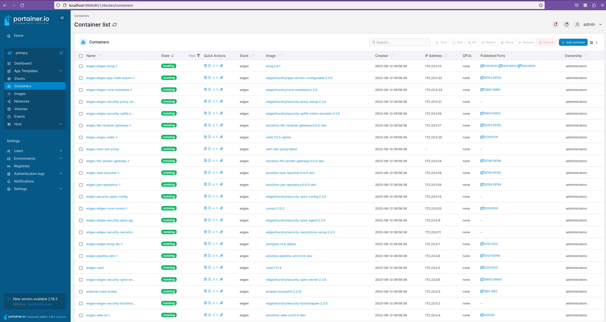

# Two-System Setup

The following are procedures to set up a two-system setup. For a single-system setup, please refer to the [Get Started Guide](./Get-Started-Guide.md).

## Step 1: Configure the Gateway

### Generate Keys (Optional)

This is only **required in a two-system** setup. In order to use the SSH tunnel between the systems, it is necessary to generate SSH keys. 
Only the public key will be shared to the OEM system. Each keypair should be unique to its deployment for security purposes.

1. Generate ssh keys on the Gateway System: `make generate-ssh-tunnel-keys`
2. Copy generated public key to the OEM system filling in the appropriate username for `<oem-user>`, system name for `<OEM-System>`, and path to the repository `/path/to`.
    ```bash
    $ scp -r edgex-res/remote/sshd-remote/authorized_keys <oem-user>@<OEM-System>:/path/to/applications.retail.kaskey-park.kaskey-park/edgex-res/remote/sshd-remote/authorized_keys
    ```
   
   > **Note**  
   > If it is not possible to use `scp` to move the file, use a USB flash drive to move the file `edgex-res/remote/sshd-remote/authorized_keys` on the gateway to `/path/to/applications.retail.kaskey-park.kaskey-park/edgex-res/remote/sshd-remote/authorized_keys` on the OEM.

### Modify Firewall Rules (Optional)

This is only **required in a two-system setup with a Windows OEM** system.  

Depending on the network setup, it may be necessary to create an inbound rule in order to allow traffic in for SCP on port 2222 and for the port forwarding on port 2223.
Creating inbound/outbound rules on Windows can be done following the instructions [here](https://learn.microsoft.com/en-us/windows/security/operating-system-security/network-security/windows-firewall/best-practices-configuring).
To turn off the Windows Defender Firewall, follow the steps [here](https://support.microsoft.com/en-us/windows/turn-microsoft-defender-firewall-on-or-off-ec0844f7-aebd-0583-67fe-601ecf5d774f).

### Configure Specific Services

If a custom configuration option is not needed, return to the main installation flow, [Build and Deploy](#step-2-build-and-deploy-the-gateway-and-oem). 

The table below provides links to configuration options along with the computer it should run on (if using a two system setup). 

| Component                             | Description           | Modify Configuration To  | 
|:--------------------------------------|-----------------------|----------------------------|
| [File Watcher](../services/ms-file-watcher.md#configuration) | The File Watcher component monitors selected folder(s) for new files to process.  | Exercise greater control over the File Watcher component. (e.g., Refinement of file filtering)   | 
| [Data Organizer > Attribute Parser](../services/ms-data-organizer.md#attribute-parser) | The Data Organizer helps route calls from other microservices to the job repository. The attribute parser of the data organizer can parse the file name of a job for attributes.  | Customize file name information gathering.   |
| [Task Launcher > RetryWindow ](../services/as-task-launcher.md#configuration) | The Task Manager manages and launches tasks for jobs to be executed on the Pipeline Simulator, Intel® Geti™ platform pipelines, or BentoML pipelines  | Set the frequency for resubmitting jobs to a pipeline.    |

## Step 2: Build and Deploy the Gateway and OEM

### Build Containers

1. Use one of the command line options below to build: 

    | Build Type | Build Command                             | When To Use                                                                                                   |
    |:--------------|-------------------------------------------|---------------------------------------------------------------------------------------------------------------|
    | General Build | `make <docker-target>`                    | The system resources are unknown.                                                                             |
    | Fast Build    | `make -j<num of threads> <docker-target>` | The flag -j represents the number of jobs in a build. The optimal integer for j depends on the system resources (e.g., cores) and configuration. |

    Where `<docker-target>` can be one of the following:

    | Docker Target | Description                                                                                                                                                                                                          |
    |---------------|----------------------------------------------------------------------------------------------------------------------------------------------------------------------------------------------------------------------|
    | docker | builds all custom docker containers to run in a single system setup                                                                                                                                                  |
    | docker-build-gateway | builds [Gateway](./services/gateway-services.md#job-repository) custom docker containers                                                                                                                                          |
    | docker-build-oem | builds [OEM](./services/oem-services.md#file-watcher) specific custom docker containers - this requires the [SSH Configuration](#generate-keys-optional) to be complete before the containers can be built |

      > **Warning**  
      > Leave plenty of time for this step to complete, up to 30-40 minutes. Console output may appear to hang while conducting parts of the build process using intermediate containers. Red text is not necessarily concerning, so allow the process to finish.

2. For a two system setup, on the Gateway, it is necessary to update `<OEM_IP_ADDRESS>` with the appropriate IP address of the OEM system in the docker-compose-edgex-spiffe-spire.yml file. To obtain the IP address use `hostname -I` on Linux or `ipconfig` on Windows. 

      > **Note**  
      > For an OEM system running in WSL, use the IP address of the Windows system.


### Run the Services

The table below describes the different run options available. 


1. Run the docker images for the gateway (or all on one, if desired). Choose **one** of the run targets below (depends on the pipeline type and number of systems):

   > **Note**  
   > It is recommended to use the simulated pipeline for a trial setup. Using the simulated pipeline on a single system is the simplest configuration.

    | Pipeline Option                           | Run Target              | Description                                                            | Number of Containers |
    |:------------------------------------------|-------------------------|------------------------------------------------------------------------|---------------------:|
    | Simulated Pipeline (Gateway)              | `make run-gateway-sim`  | Run the microservices with a set of simulated pipelines          |                   22 |
    | Simulated Pipeline (single system)        | `make run-sim`          | Run the microservices with a set of simulated pipelines          |                   21 |
    | Geti Pipeline (Gateway)                   | `make run-gateway-geti` | Run the microservices with Intel® Geti™ platform pipelines for the Gateway System |                   23 |
    | Geti Pipeline (single system)             | `make run-geti`         | Run the microservices with Intel® Geti™ platform pipelines                        |                   22 |
    | OpenVino Model Server (Gateway or single) | `make run-ovms`         | Run the OVMS container                                                |                    1 |

      > **Note**  
      > The optional `GATEWAY_IP_ADDR=192.168.X.X` parameter can be added to the make command in order for the web UI to be accessed from an external system. This command would read `make <run-option> GATEWAY_IP_ADDR=192.168.X.X`. To get the IP address of a Linux system run `hostname -I`.
    
      > **Success**  
      > For two system, verify that the logs of the `edgex-oem-ssh-proxy` container say
        ```bash
           + scp -p -o 'StrictHostKeyChecking=no' -o 'UserKnownHostsFile=/dev/null' -P 2223 /srv/spiffe/remote-agent/agent.key '<OEM_IP_ADDRESS>:/srv/spiffe/remote-agent/agent.key'
           scp: Connection closed
           ssh: Could not resolve hostname <oem_ip_address>: Try again 
        ```

      > **Success**  
      > For a microservice, the logs should look something like this task-launcher sample log:
        ```bash
           level=INFO ts=2023-06-12T16:58:55.042728315Z app=app-task-launcher source=server.go:162 msg="Starting HTTP Web Server on address task-launcher:59785"
           level=INFO ts=2023-06-12T16:58:55.043443755Z app=app-task-launcher source=messaging.go:104 msg="Subscribing to topic(s): 'NONE' @ redis://edgex-redis:6379"
           level=INFO ts=2023-06-12T16:58:55.043454019Z app=app-task-launcher source=messaging.go:113 msg="Publishing to topic: '{publish-topic}' @ redis://edgex-redis:6379"
           level=INFO ts=2023-06-12T16:58:55.04346657Z app=app-task-launcher source=service.go:202 msg="StoreAndForward disabled. Not running retry loop."
           level=INFO ts=2023-06-12T16:58:55.043471401Z app=app-task-launcher source=service.go:205 msg="Started the task launcher microservice"
           level=INFO ts=2023-06-12T16:58:55.043518377Z app=app-task-launcher source=messaging.go:125 msg="Waiting for messages from the MessageBus on the 'NONE' topic"
           level=DEBUG ts=2023-06-12T17:28:54.018134531Z app=app-task-launcher source=secrets.go:345 msg="token is successfully renewed"
        ```

2. For a two system setup, on the Gateway, add the server entries for the OEM side to authorize the services running on the OEM side.

    ```bash
      $ make add-ssh-server-entry
    ```

      > **Note**  
      > This only needs to be run the first time the Gateway services are started or after the volumes have been cleaned.

3. For a two system setup, start the OEM services on the OEM system. (This should start 6 containers.) 

    ```bash
      $ make run-oem
    ```
   
      > **Warning**  
      > The OEM system must be started within **one hour** of starting the Gateway system.  
      > Failure to do so will result in the services not connecting or functioning properly.

      > **Success**  
      > The `edgex-remote-spire-agent` logs should have lines that look like:
        ```bash
            time="2023-06-05T22:20:35Z" level=debug msg="Fetched X.509 SVID" count=1 method=FetchX509SVID pid=3559771 registered=true service=WorkloadAPI spiffe_id="spiffe://edgexfoundry.org/service/app-file-receiver-oem" subsystem_name=endpoints ttl=3597.506151713
        ```
        A microservice (i.e., `file-receiver-oem`) should look like:
        ```bash
            level=INFO ts=2023-06-07T15:31:23.916977876Z app=app-file-receiver-gateway source=server.go:162 msg="Starting HTTP Web Server on address file-receiver-gateway:59783"
        ```

   
3. Verify the correct number of containers are running using `docker ps` or `make run-portainer`. If using Portainer, open [Portainer](http://localhost:9000) in a browser. Here's an example screenshot of all the gateway services running in Portainer (high-level check that the stack is in a green/running state):

      

      Figure 1: Example of Gateway Services Running in Portainer

## Step 3: Set Up the Pipeline on the Gateway

> **Note**  
> It is recommended to first get familiarized using the **Basic Workflow** with **Simulated Pipelines** before attempting the **Advanced Workflows**.  
>
> For **Basic Workflow** with **Simulated Pipelines**, no pipeline configuration is needed. Please proceed to Step 4: [Basic Workflow](#step-4-start-a-basic-workflow-on-the-gateway) page.

The following are **Advanced Workflows** for building custom pipelines. 


| Run Option                  | Pipeline Configuration Instructions                   | 
|------------------------|:------------------------------------------------------|
| Geti Pipeline      | [Use Intel® Geti™ platform pipelines](./Pipeline-Configuration.md) |


## Step 4: Start a Basic Workflow on the Gateway

The following activity will require access to both systems (if using two). These steps assume that the systems have been set up following
Step 2: [Build and Deploy](#step-2-build-and-deploy-the-gateway-and-oem). 

   > **Note**  
   > If running on a single system, all activities labeled **OEM** or **Gateway** will be completed on the same system.

**Objective:** Process an image file from an OEM microscope on the Gateway system.

1. On the **Gateway** system, create a task. A task is the method by which input images are matched to a processing pipeline.
    
      > **Note**  
      > This assumes that the pipeline(s) are running and configured. Either use the pipeline simulator or follow the [Pipeline Configuration](./Pipeline-Configuration.md) chapter to set up an ML pipeline using a model from Intel® Geti™ platform.)

    1. This can be done using **one** of the following methods:

        - **Web User Interface (UI)** - follow the instructions in the [Create Task](./Web-UI-Guide.md#create-task) section.
        - **CURL command line tool** - developer exercise based on schema (e.g. Postman collection) or API definitions for the services

2. On the **OEM** system, drop a file to be processed.
    1. Once all the services are up and running, open a File Explorer window and enter `$HOME/data/oem-files/input` into the navigation bar. This is the default folder that the system will watch for files to be processed. If no GUI is available, use `cd $HOME/data/oem-files/input` in a Terminal to navigate to the input directory.
    2. Drop a file into the `$HOME/data/oem-files/input` folder using **one** of the methods below:

        - **Process an individual file** - Drag and drop an image file using the File Explorer. If no GUI is available, copy the file using `cp` in a Terminal.
        - **Process a directory of files** - Use the copy-files make target to copy all files in a directory to the input folder.

            ```bash
            make copy-files COPY_DIR=/path/to/dir
            ```

         > **Note**  
         > The default wait time between files being copied to the folder is 30 seconds. To change this, update the SLEEP_TIME variable.

                make copy-files COPY_DIR=/path/to/dir SLEEP_TIME=15
                

         > **Note**  
         > Be sure that the Job Selector rule from creating a task is consistent with the file name. This is what will trigger an event to process the file.
     
    3. Check to see if there are any files in the `$HOME/data/oem-files/output` folder.

         > **Note**  
         > Depending on the chosen pipeline an output file may not be generated. For example, using the `results-only` pipeline on the pipeline simulator will not generate an output file.

3. On the **Gateway** system, check the status of the file and its associated job using one of the following methods:
       
      > **Note**  
      > The status will be Complete if the job has been successfully processed. Otherwise, the Owner field will show what component is processing the job.

      - **Web UI** - [View Jobs](./Web-UI-Guide.md#job-management) on Web UI.
      - **Command Line** - follow the instructions below.
        1. Query for all jobs using `curl localhost:59784/api/v1/job | json_pp`. 
        2. Search the output for the desired input file name and grab the job id.
        3. Copy the job id and use it to query for details on the specified job `curl localhost:59784/api/v1/job/<job_id> | json_pp`.

      > **Note**  
      > To check the status of the pipeline processing the image, check the logs of the `edgex-pipeline-sim-1` container.

If the job did not complete, see [Troubleshooting](./Troubleshooting.md).

