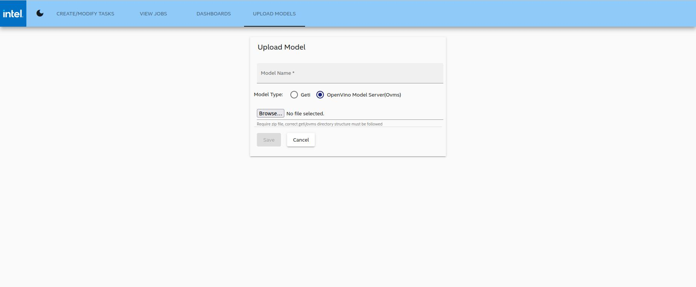

# Web User Guide - Model Upload

The **Upload Models** page provides functionality to upload the AI/ML models to create new pipelines. This feature supports Intel Geti models and those served by the OpenVINO™ Model Server (OVMS)

To upload a new model:

1. Complete the following fields with the model details:

    -  **Model Name**: enter Model Name
  
    -  **Model Type**: click to select the type of the model - 
     
        -- **Geti**

        -- **OpenVino Model Server(OVMS)** - *default option*
  
2. Click **Browse** to select the zipped Geti/Ovms models.

    !!! Warning
        - Zip file is **required**. 
        - Correct Geti/OVMS directory structure must be followed.
        
3. Click **Save**.

<figure class="figure-image">

<figcaption>Figure 1: Upload Model</figcaption>
</figure>

## Next up

[Web UI Guide - Dashboards](./ms-web-ui-guide-dashboards.md)

INTEL CONFIDENTIAL: See [License](../LICENSE.md).
