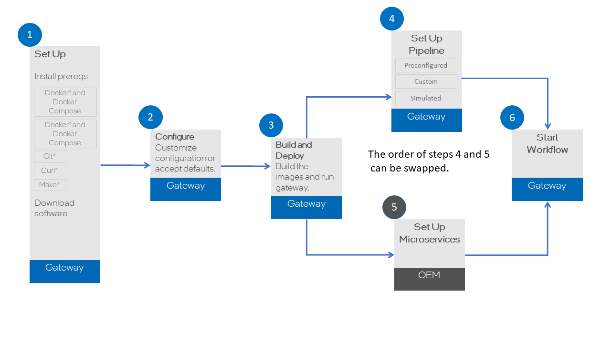

# What to Expect 
This guide details setup for two working models:
- Two System: a Linux Gateway and Windows WSL2 or Linux OEM where the two systems communicate to each other using a secure SSH Tunnel (port forwarding)
- Single System: a Linux or Windows WSL2 setup where all services for the OEM and Gateway will run on the same system, likely for development or test purposes.
For more information on the services that will be running and how the two systems will communicate, see [Image Processing](../services/general-info.md#image-processing).

## Prerequisites
### What You'll Need

#### Hardware
Configure a network that includes:

- System running Ubuntu 20.04 (Gateway)
- System running Windows® 10 with WSL2 or Ubuntu 20.04 (OEM)

Both systems must be on the same network.

#### Software 
The sections under Get Started detail how to install software prerequisites for both systems:

- Docker (v >= 23.0) and Docker Compose
- Make
- Git
- Curl

### What You'll Do

!!! tip
    ** Order of Installation **

    The order of the steps in Get Started is recommended for first time installation. 

## Next up

[Set Up](install-prereqs.md)

BSD 3-Clause License: See [License](../LICENSE.md).