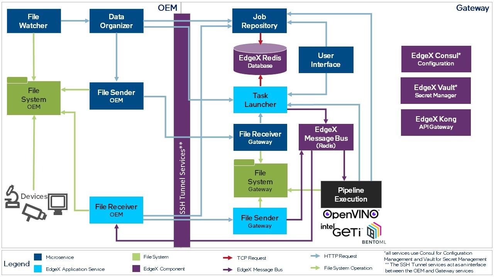

# AI Connect for Scientific Devices (AiCSD)

The AiCSD reference implementation manages pipelines for image processing and automated image comparisons.  
Adaptable for different use cases and settings, the reference implementation offers an architecture of microservices connected by a secure Redis Message Broker and various communication APIs.
This flexible architecture can be customized for many applications, such as biopharma, agricultural, and industrial.

Figure 1 below shows the services created for this reference implementation and the flow of data through the architecture. 

<figure class="figure-image">

<figcaption>Figure 1: Architecture and High-level Dataflow</figcaption>
</figure>

The architectural components include: 

- **Microservices:** Provided by Intel, the microservices include a user interface and applications for managing files and jobs.
- **EdgeX Application Services:** The reference implementation uses the APIs from the EdgeX Applications Services to communicate and transfer information. 
- **EdgeX Services:** The services include the database, message broker, and security services.
- **Pipeline Execution:** The reference implementation furnishes an example pipeline for pipeline management.
- **File System:** The reference implementation stores and manages input and output files.
- **Third-party Input Devices:** The devices supply the images that will be processed. Examples include an optical microscope or conveyor belt camera.

!!! Note
    Currently, the reference implementation supplies a biopharma pipeline example.

## Setup
Set up a 2-system configuration, an edge system running Ubuntu and OEM equipment running WSL2 or Ubuntu.

- **System Setup Completion Time**: Approximately 30-90 Minutes
- **Workflow Completion Time:** Approximately 30-60 Minutes

[Get Started](./getting-started/what-to-expect.md){: .md-button .md-button--primary }

## Additional Resources
For additional details, see the [General Information](./services/general-info.md).

BSD-3 License: See [License](LICENSE.md).