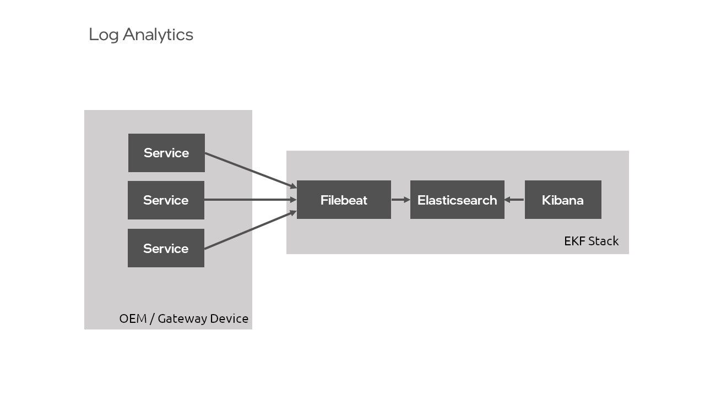
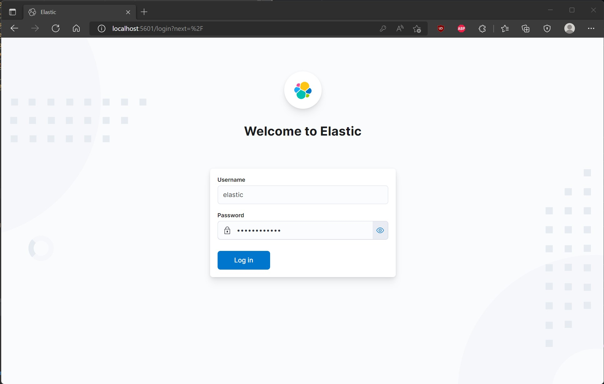
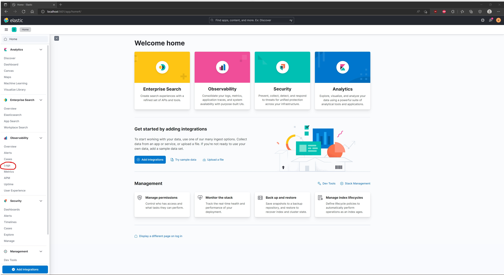
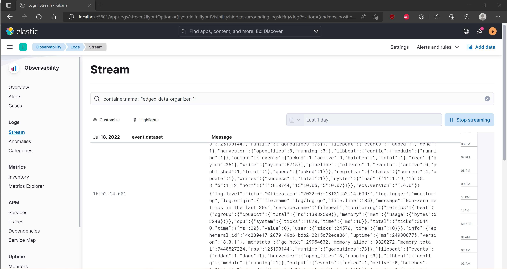
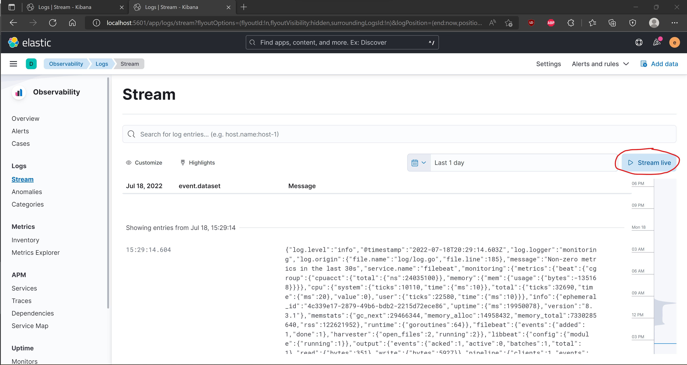

# Overview
The open-source tools, [Elasticsearch](../log-analytics/elasticsearch.md), Logstash, and [Kibana](../log-analytics/kibana.md) (ELK), comprise the ELK stack, a tech stack commonly used for log analytics. AiCSD implements a variation of the ELK tech stack for its container and service logs, replacing Logstash with the use of [Filebeat](../log-analytics/filebeat.md).

Figure 1 illustrates the data flow and component relationships in the stack.

## Architecture

<figure class="figure-image">

<figcaption>Figure 1: Log Analytics</figcaption>
</figure>


!!! Note
    It isn't necessary to download the tools of the ELK stack separately as they are included in the log analytics feature of AiCSD. However, to find out more about each tool, see the Resources section for each of the tools.

## Enable Log Analytics
To enable log analytics services, update authentication information in the `.env` file found within the root directory, as described in [Run the Services](#run-the-services). 

!!! Note
    While some out-of-the-box security measures were taken for the single-user environment, this repository contains the base implementation for log analytics. It is not configured for complex projects or deployment-specific security concerns.

### Run the Services
To update the authentication information in the `.env` file:

1. Open up `.env` found at the root level of this project.
2. Scroll down to the bottom of the file to the `Log analytics` section.
3. Find the `ELASTIC_PASSWORD` variable and update the value with a password at least 8 characters in length. Be sure to remove the `<>` characters.
4. Find the `KIBANA_SYSTEM_PASSWORD` variable and update the value with a password at least 8 characters in length. Be sure to remove the `<>` characters.
5. Start Elasticsearch, Filebeat, and Kibana:

    ```bash
    make run-log-analytics
    ```

    This command creates a `log-analytics` docker network and bring up the services necessary for these purposes.

### View Log Analytics
To view the log analytics within the Kibana UI, visit: [http://localhost:5601](http://localhost:5601).

To best navigate the Kibana UI, follow these next steps:

1. Log in using the `elastic` username and the `ELASTIC_PASSWORD` that was set in the `.env` file.
   

2. Go to the nav bar in the upper left-hand corner and click on the `Logs` section under `Observability`.
   

   1. Click in the `Search for log entries...` section and search the logs using the field of most interest.
   A first suggestion would be to type `container.name`, then click on the field that pops up titled `container.name`.
   

3. Type in the name of one of the services of interest and click `Live Stream`.
   

5. Verify logs are streaming in the entries section below.

BSD-3 License: See [License](../LICENSE.md).