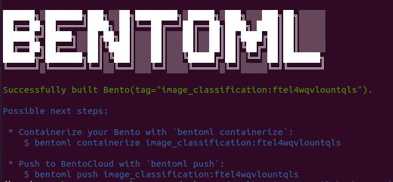
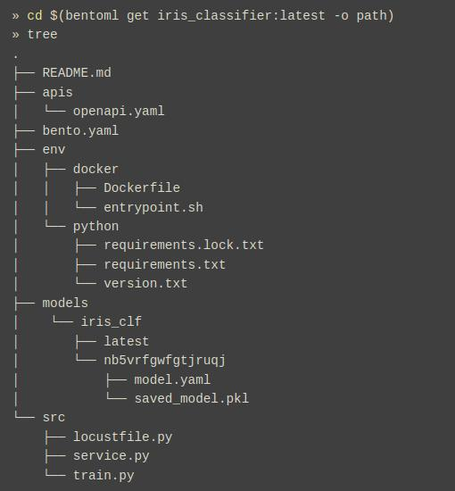

# Create Bentos

## Introduction

A bento is a file archive with all the model training source code and APIs defined for serving: saved binary models, data files, Dockerfiles, dependencies, and additional configurations. Everything fits together as a unit and is packaged into a standardized format.

## Bento Service

Every bento must consists of the following files:

 - **service.py** - User defined inference program is converted into an api service using this **service.py** file
 
 - **bentoml.yaml** - This is a configuration file used for building a bento

Learn More: [Create Bento Service](https://docs.bentoml.org/en/latest/concepts/service.html)

## Build

A Bento can be created with the *bentoml build* CLI command with a bentofile.yaml build file. 
    
```bash
 bentoml build
```
When bento is built successfully, **bento_image_name:bento_image_tag** is displayed as shown in *Figure 1*
<figure class="figure-image">

<figcaption>Figure 1: Successful BentoML Creation</figcaption>
</figure>

List locally built bentos
    
```bash
 bentoml list
```

Display bento contents
    
```bash
 cd $(bentoml get <bento_image_name>:latest -o path)
 tree
```

Learn More: [Build Bento](https://docs.bentoml.org/en/latest/concepts/bento.html#)


<figure class="figure-image">

<figcaption>Figure 2: Bento Tree</figcaption>
</figure>

## Next up
[Deploy Bentos](deploy-bentos.md)

INTEL CONFIDENTIAL: See [License](../../LICENSE.md).