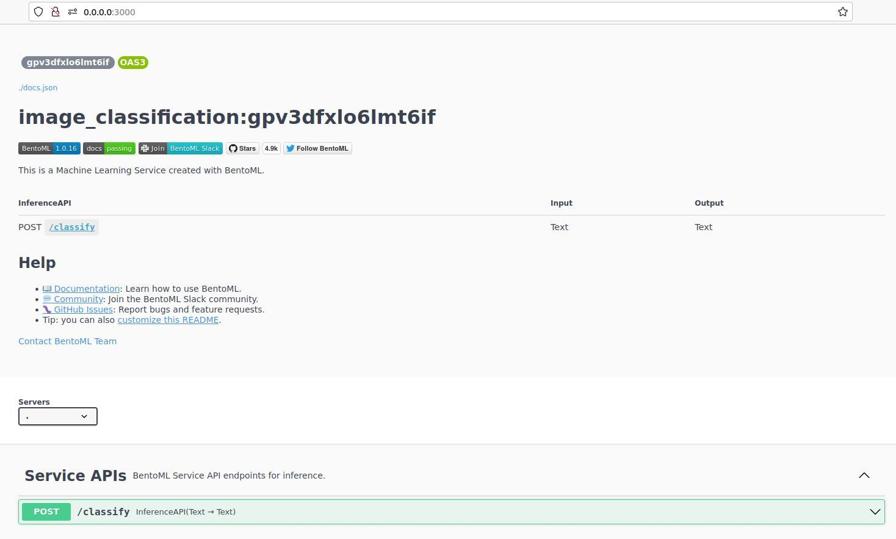

# Deploy Bentos

Bentos can be deployed using the following methods:

 - Containerize and deploy as custom docker containers 
 - Use [Yatai](https://github.com/bentoml/Yatai) to deploy them at scale on Kubernetes
 - Use [bentoctl](https://github.com/bentoml/bentoctl) for fast model deployment on any cloud platform

Learn More: [Bento Deployment](https://docs.bentoml.org/en/latest/concepts/deploy.html)

## Deploy Locally
```bash
 bentoml serve
```
## Deploy Docker Containers

Create containers with the bento images
    
```bash
 bentoml containerize <bento_image_name>:latest
```
Run the generated docker image

```bash
 docker run -p 3000:3000 <bento_image_name>:<bento_image_tag> serve --production
```
Deployed docker container can be now viewed via Portainer
<figure class="figure-image">

<figcaption>Figure 1: BentoML Container in Portainer</figcaption>
</figure>

After bento is deployed, service can be accessed via swagger api UI - **http://0.0.0.0:3000/**
<figure class="figure-image">

<figcaption>Figure 2: BentoML Swagger API UI</figcaption>
</figure>

## Next up
[Developer Guide](developer-guide-bentos.md)

BSD-3 License: See [License](../../LICENSE.md).