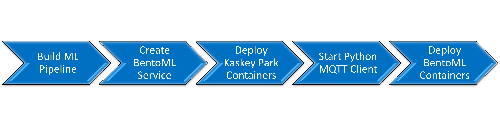
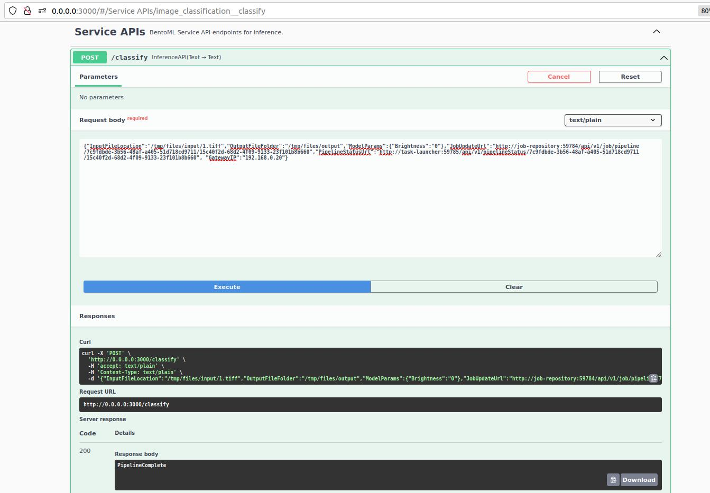

# Developer Guide

## Overview

This Developer Guide will walk you through the steps required to create your own BentoML services and integrate them with the AiCSD Project.

## Workflow

As a Data Scientist, Machine Learning Engineer, or Software/Solutions Engineer building AI/ML software or solutions, BentoML provides an easy way to create, containerize, and deploy ML pipelines as docker services which can then be integrated with the AiCSD project for automatic transfer of scientific images. These images are captured using OEM devices connected to microscopes, cameras, etc. and are transferred to a higher compute Gateway device. The ML pipelines are executed on the Gateway by applying image processing models and by making meaningful inferences to generate output images or results.

<figure class="figure-image">

<figcaption>Figure 1: ML Pipeline Service Development & Deployment Workflow</figcaption>
</figure>

### **ML Pipeline Creation**

1. Develop the initial code for AI-assisted image processing and inferencing. Test it out locally to ensure results are as expected.

1. Either add the model directly to the AiCSD project's **models** folder(and update **config.json** if OpenVINO is used for inferencing) or use the [Upload Models](../../getting-started/ms-web-ui-guide-upload-model.md) feature of the UI. Model directory structure must follow the OVMS structure with a subdirectory named **1** and everything else falling inside this as subdirectories.

1. ML pipelines with no models can also be created. However, make sure to either upload the zipped folder with an empty subdirectory of 1 or add the directory with an empty subdirectory of 1 under the AiCSD project's **models** folder(and update **config.json** if OpenVINO is used for inferencing). Name of this directory will appear in the pipeline dropdown while [Creating a New Task](../../getting-started/ms-web-ui-guide-tasks.md)

    !!! Warning
        - If the directory (with or without model) is not uploaded, then the ML pipeline will not be created. It will not be displayed in the pipeline dropdown while [Creating a New Task](../../getting-started/ms-web-ui-guide-tasks.md)
        - Model directory structure must follow the [OVMS guidelines](https://docs.openvino.ai/latest/ovms_docs_models_repository.html) with sub-directory named **1** and everything else falling inside this as files or sub-directories.

1. For integrating the user defined ML pipeline with AiCSD, the below mentioned files need to be included in the project directory. These files for the sample image classification demo can be used as reference during development. These files are present under the **demos** folder in the AiCSD project repo.
   
    - **paho_mqtt_client.py** - Start a MQTT client listening to request coming from the AiCSD containers
   
    - **pythonClientConfig.yaml** - Configuration file for the ML pipeline, **gateway_ip**, and **service/POST_url** should be set by the user with the Gateway IP address
   
    - **helper.py** - Functions to create response to be sent back to the AiCSD containers
   
    - **service.py** - User defined inference program is converted into a BentoML API service using this file
   
    - **bentofile.yaml** - Configuration file for building a BentoML service

    - **Makefile** - Automate the BentoML CLI commands and MQTT client to build and run bentos and the MQTT client docker containers

1. Ensure the following for integration with AiCSD
 
    - Modify **main** function - add it as a function that will be called from the BentoML  **service.py** file and processing results will be sent back as response.

    - Import the user defined ML pipeline as a package inside **service.py**

    - **service.py** expects the input in the following json format:
    
    ```json
        {
            "InputFileLocation":"/path/to/input file",
            "OutputFileFolder":"/path/to/output files",
            "ModelParams":{"model parameters specific to the pipeline"},
            "JobUpdateUrl":"REST API endpoint for updating job",
            "PipelineStatusUrl":"REST API endpoint for updating pipeline status", 
            "GatewayIP":"gateway IP address"
        }
    ```
    
    - Within the **@svc.api** inside **service.py**, make calls to the user defined ML pipeline passing the input and output file paths and then store the response as results. 

        !!! Note
            When deploying BentoML service as docker containers, the Input/Output file path will be **/tmp/files/input** and **/tmp/files/output** which are the paths mapped through volume mount during docker execution. If service is deployed locally then these should be absolute filesystem paths.
  
    - Import **helper.py** inside the user defined ML pipeline as a package to create the response. AiCSD expects the response in the following format -
   
    ```json
        {
        "Status" : "PipelineComplete", // or "PipelineFailed"
        "QCFlags" : "Quality Control string, can be empty", 
        "OutputFiles" : "[
            {
                "DirName": "/path/to/file",
                "Name": "file_name.extension",
                "Extension": "file extension without the .",
                "Status": "current status - can be empty",
                "ErrorDetails": "detailed error message- can be empty",
                "Owner": "current owner - can be empty"
            },
            {
                // repeat as necessary
            }
        ], 
        "Results" : "any results string to be displayed in the AiCSD UI"
        }
    ```

    - Refer to [Job Repository Update](../../pipelines/pipeline-creation.md) for more details on pipeline callbacks.

    - It is important to follow the order of callbacks within **@svc.api** inside **service.py**. Job must be updated first followed by Task.

    - It is mandatory to update the **Status** field as **PipelineComplete** or **PipelineFailed** for reflecting the correct job status on [AiCSD UI](../../getting-started/ms-web-ui-guide-jobs.md).
 
    - Set **gateway_ip** in **pythonClientConfig.yaml** file.

    - MQTT client is listening to AiCSD's EdgeX MQTT Broker on topic **mqtt-export/pipeline/params**.

    - Other MQTT parameters like port can be configured in **pythonClientConfig.yaml**.

    - ML pipeline bento service configurations, like port etc, can be configured within **bentoml.yaml**. Thus multiple pipelines can be configured to run on different ports for scalability.

    - Logger() doesn't work inside the BentoML container/terminal logs, use print() for logging purposes. 

### **BentoML Service Creation & Deployment**

1. To avoid any package incompatibility issues, it is **highly** recommended to install and use [conda](https://docs.conda.io/projects/conda/en/latest/user-guide/install/linux.html) environment.

1. Create and activate a new conda environment 
   ```bash
   conda create -n bentoml_env
   conda activate bentoml_env
   ```

1. Change directory to the ML pipeline project eg. **demos/image_classification_example**

1. Install prerequisites 
   ```bash
   pip install -r requirements.txt
   ```
1. Build BentoML services following steps mentioned [here](../../pipelines/bentoml/create-bentos.md)
   ```bash
   bentoml build
   ```
1. Note the bento tags - **bento_image_name:bento_image_tag** as displayed in *Figure 2*
   <figure class="figure-image">
   
   <figcaption>Figure 2: Successful BentoML Creation</figcaption>
   </figure>

1. Deploy with commands mentioned [here](../../pipelines/bentoml/deploy-bentos.md)


    - Deploy Locally
  
     ```bash
      bentoml serve
     ```

    or

    - Deploy Container

     ```bash
      bentoml containerize <bento_image_name>:latest
      docker run -it --rm -p 3000:3000 -v ${HOME}/data/gateway-files:/tmp/files <bento_image_name>:<bento_image_tag> serve --production
     ```

1. Verify if service is deployed by opening Swagger API UI - **http://0.0.0.0:3000**
    
    Service can be tested by providing the following json input

    !!! Note
        Both AiCSD Services and the python MQTT client should be running for successful response. Refer to [Build & Deploy](#end-to-end-ml-pipeline-execution) for more information.
   
    ```json
       {
            "InputFileLocation":"/tmp/files/input/1.tiff",
            "OutputFileFolder":"/tmp/files/output",
            "ModelParams":{"Brightness":"0"},
            "JobUpdateUrl":"http://job-repository:59784/api/v1/job/pipeline/7c9fdbde-3b56-48af-a405-51d718cd9711/15c40f2d-68d2-4f09-9133-23f101b8b660",
            "PipelineStatusUrl":"http://task-launcher:59785/api/v1/pipelineStatus/7c9fdbde-3b56-48af-a405-51d718cd9711/15c40f2d-68d2-4f09-9133-23f101b8b660", 
            "GatewayIP":"192.168.0.20"
        }
    ```

    <figure class="figure-image">
    
    <figcaption>Figure 3: Successful Swagger API Response</figcaption>
    </figure>

1. Verify if container is deployed by checking [Portainer](../../getting-started/troubleshooting.md)

### **End to End ML Pipeline Execution**

1. To avoid any package incompatibility issues, it is **highly** recommended to install and use the [conda](https://docs.conda.io/projects/conda/en/latest/user-guide/install/linux.html) environment.

1. Create and activate a new conda environment 
   ```bash
   conda create -n bentoml_env
   conda activate bentoml_env
   ```

1. Change directory to the AiCSD project root folder on the Gateway.

1. Clean the workspace
 ```bash
  make clean-volumes clean-images clean-files
 ```

1. [Build & Deploy](../../getting-started/system-setup.md) all AiCSD Containers
 ```bash
  make docker
  make run-geti run-ovms
 ```

1. Change directory to the **demos/custom pipeline** folder in the AiCSD project repo.

1. Install prerequisites 
   ```bash
   pip install -r requirements.txt
   ```

1. If any existing bento and MQTT client docker containers are running, then stop and remove them using **make** commands run inside the **demos/custom pipeline** folder in the AiCSD project repo.
 ```bash
  make down BENTO_TAG=<bento_image_name>:<bento_image_tag>
 ```
Old BENTO_TAGs (eg. **image_classification:px4jhnqscwuntqls**) can be found under **Images** section in [Portainer](../../getting-started/troubleshooting.md)

1. Set **gateway_ip** and **service/POST_url** in pythonClientConfig.yaml file.

    !!! Note
        **gateway_ip** can be obtained using this command:
        ```bash
         hostname -I
        ```

1. Run **make** commands inside the **demos/custom pipeline** folder in the AiCSD project repo.
 ```bash
  make build 
  make docker-build BENTO_TAG=<bento_image_name>:<bento_image_tag>
  make run BENTO_TAG=<bento_image_name>:<bento_image_tag>
 ```
  **bento_image_name:bento_image_tag** should be copied from the output from `make build` command.
 For more details on these individual bentoml build and run commands refer to [Build & Deploy BentoML services](#bentoml-service-creation-deployment) 

1. Follow steps for [Basic Workflow](../../getting-started/basic-workflow.md) to create a new Task, drop the image file for processing and view the results on the UI.

Refer to Complete Demo: [Image Classification](../../pipelines/bentoml/image-classification-demo.md)

BSD-3 License: See [License](../../LICENSE.md).
