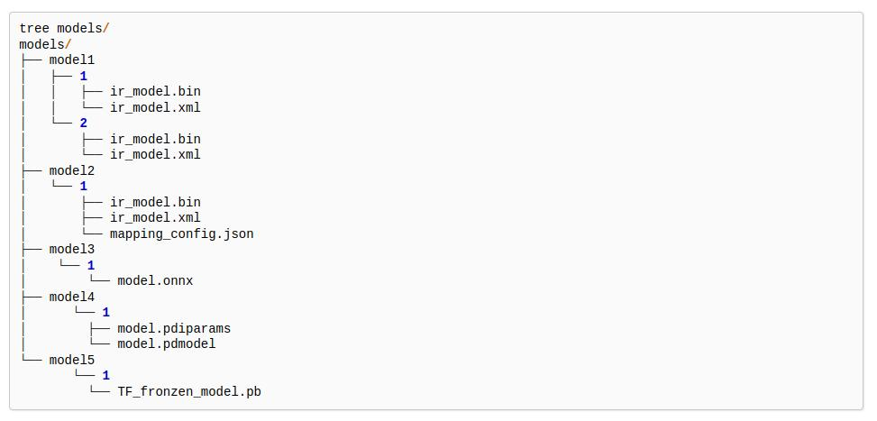
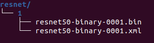
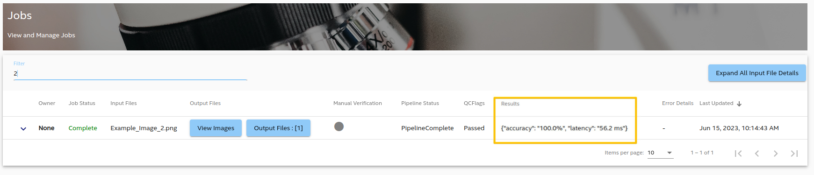

## Overview

In this end to end demo, the [Image Classification](https://docs.openvino.ai/latest/ovms_demo_image_classification.html) example posted in [OpenVINO Github Repo](https://github.com/openvinotoolkit/model_server/tree/releases/2022/1/demos/image_classification/python) is modified to build this BentoML docker service, then integrated to make this ML pipeline work with the AiCSD project. 

### Workflow

1. Image captured from the OEM device is automatically transferred to the Gateway for ML pipeline processing.

1. This ML pipeline performs image processing by reading all images and their labels specified in the text file. It then classifies them with the [ResNet50](https://docs.openvino.ai/2022.2/omz_models_model_resnet50_binary_0001.html) model and presents accuracy and latency results.

1. Results are then sent back and can be viewed through the AiCSD UI.

### Steps to Run Demo 

1. Download the [ResNet50](https://docs.openvino.ai/2022.2/omz_models_model_resnet50_binary_0001.html) model from [OpenVINO Github Repo](https://github.com/openvinotoolkit/open_model_zoo/blob/master/models/intel/resnet50-binary-0001/README.md) using the [Model Downloader](https://docs.openvino.ai/2023.0/omz_tools_downloader.html) tool from OpenVINO. Follow steps at this [link](https://docs.openvino.ai/2023.0/omz_tools_downloader.html) to download the **ResNet50** model.

1. For ML pipeline processing with OpenVINO on CPU for the Gateway hardware, select FP32 version of the model. If processing occurs on GPU or VPU, then FP16 version of the model can be used.

1. Downloaded Model consists of the bin & xml files for OpenVINO - **resnet50-binary-0001.bin** & **resnet50-binary-0001.xml**.

1. Model directory structure must follow the [OpenVINO Model Server guidelines](https://docs.openvino.ai/latest/ovms_docs_models_repository.html) with sub-directory named **1** and everything else falling inside this as files or sub-directories.
 <figure class="figure-image">
 
 <figcaption>Figure 1: OpenVINO Model Server Directory Structure</figcaption>
 </figure>

1. Model Directory sturcture for this **resnet** model should be as shown below -
 <figure class="figure-image">
 
 <figcaption>Figure 2: Resnet Model Directory Structure</figcaption>
 </figure>

1. Zip the model folder and name it as **resnet**. 

    !!! Warning
        Within this zip model, ensure sub-directory is named **1** and everything else falls inside this as files or sub-directories. Upload model in next step will fail if this directory structure is incorrect.

1. [Upload this Model](../../getting-started/ms-web-ui-guide-upload-model.md) from the UI.

1. Image Classification code is available under the **demos** folder in the AiCSD project repo.

1. Follow the instructions in the **End to End ML Pipeline Execution** section in the [BentoML Developer Guide](../../pipelines/bentoml/developer-guide-bentos.md#end-to-end-ml-pipeline-execution).

1. *Figure 3* displays the job with accuracy and latency as result after executing the image classification ML pipeline via AiCSD.
 <figure class="figure-image">
 
 <figcaption>Figure 3: Image Classification Result displayed in Job UI</figcaption>
 </figure>

BSD-3 License: See [License](../../LICENSE.md).