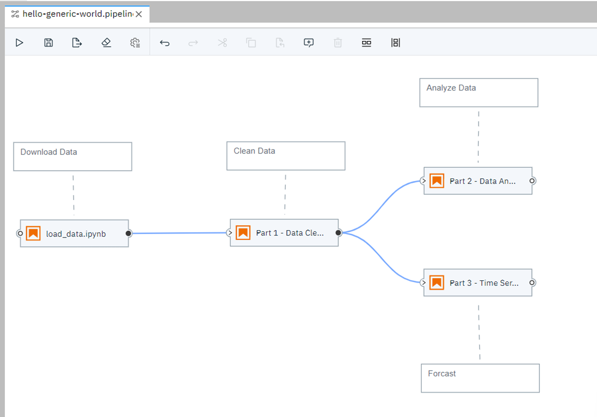
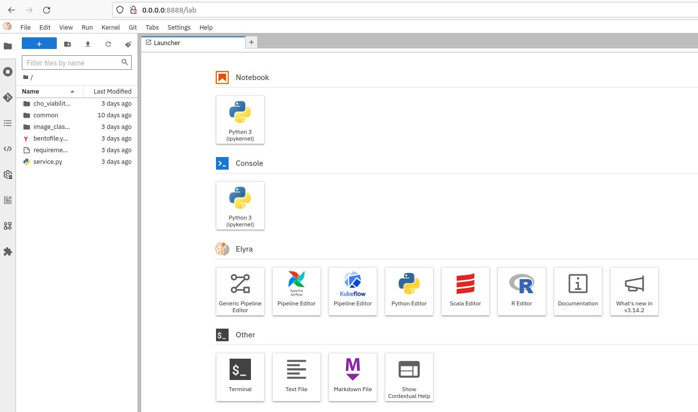

## Overview

ML Pipeline composability is an important feature while developing ML solutions. For a tool to have visualization support for ML pipeline composability, with drag and drop feature, makes it even more user friendly providing a no-code/low-code environment for development.

Elyra is a set of AI-centric extensions to JupyterLab Notebooks. It is an open source ML pipeline visual editor tool developed by IBM, that converts multiple files into batch jobs or workflow.

<figure class="figure-image">

<figcaption>Figure 1: Elyra Pipeline Composition</figcaption>
</figure>

Elyra supports different types of files like Jupyter Notebook, Python, and R scripts for developing ML pipelines. It also supports the execution of these pipelines using JupyterLab, Kubeflow, or Apache Airflow.

!!! Note
    Elyra is built for visualization of end-end ML pipeline considering individual components i.e data collection, 
    cleaning, preprocessing, training, and evaluation to be run in a distributed manner. Hence it does not provide 
    shared memory support. Some cache support is available only for Kubeflow pipelines. 
    Cache is limited by the size of the shared files to be processed.

Learn more: [Elyra](https://elyra.readthedocs.io/en/stable/)

Open Source Repository: [GitHub](https://github.com/elyra-ai/elyra)

Get Started on Elyra: [Tutorial](https://elyra.readthedocs.io/en/latest/getting_started/overview.html)

## Build & Start Elyra

!!! Note
    Password must be set for JupyterLab in the **JUPYTER_TOKEN** field of the **.env** file 
    before it is built and run. 

Use the following command to run Elyra tool

```bash
   make run-elyra
```        
    

JupyterLab with Elyra extension can be accessed through the URL - **http://0.0.0.0:8888/lab**

<figure class="figure-image">

<figcaption>Figure 2: Elyra Web Portal</figcaption>
</figure>

BSD 3-Clause License: See [License](../../LICENSE.md).