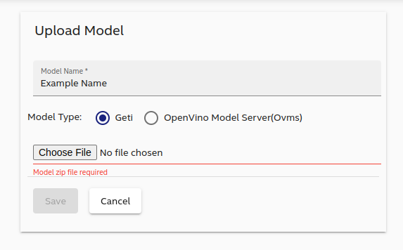

## Overview

To demonstrate the capabilities of AiCSD, the Intel team has created a sample AI pipeline using Intel Geti models and SDK.

With the Intel Geti platform, customers can train their own models for object detection, classification, segmentation, and anomaly.
After the model has been trained, customers can export the models and deploy them seamlessly on AiCSD.

Learn more: [Intel Geti](https://geti.intel.com/)

## Deploy your Geti model

Once you export the trained model from Geti you can upload it to the AiCSD Web UI or add the model into the file system manually.

### Web UI (recommended)
Navigate to the [Upload Models](../../getting-started/ms-web-ui-guide-upload-model.md) tab.

Give the model a name, select `Geti` as the model type and upload the zip file exported from Geti using the Choose File button. Then click the Save button.

### Manual
Create a subfolder under the **models** folder inside the AiCSD repo on the gateway machine. You can use any name, for example `models/cells`. 

After that, unzip the exported models file from Geti and copy the **deployment** folder inside the `models/cells` folder in the AiCSD repo.

## Create a task with new pipeline

To create a new task with the new deployed model, go to the task page on the AiCSD UI, and click on "Add Task".

On the "Pipeline" dropdown menu, it will automatically appear the new model you deployed.

## Remaining Workflow

Now follow the rest of the Workflow as illustrated [here](../../getting-started/basic-workflow.md)

BSD-3 License: See [License](../../LICENSE.md).