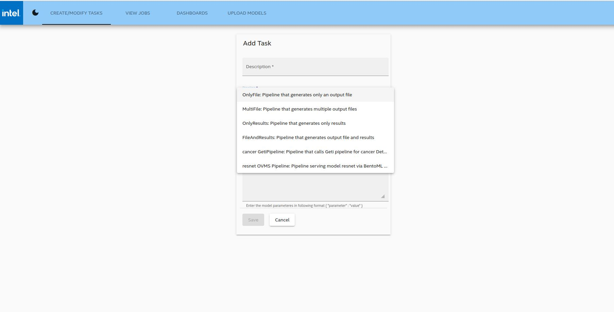

## Overview

Intel OpenVINO™ Model Server (OVMS) is a high-performance system for serving machine learning models. It is based on C++ for high scalability and optimized for Intel solutions, so that you can take advantage of all the power of the Intel® Xeon® processor or Intel’s AI accelerators and expose it over a network interface. OVMS uses the same architecture and API as [TensorFlow Serving](https://github.com/tensorflow/serving), while applying OpenVINO for inference execution. Inference service is provided via gRPC or REST API, making it easy to deploy new algorithms and AI experiments.

OVMS is integrated into the AiCSD solution to enable inferencing using ​[Intel® Distribution of OpenVINO™ Toolkit](https://www.intel.com/content/www/us/en/developer/tools/openvino-toolkit/overview.html)

Learn more: [Intel OpenVINO™ Model Server](https://docs.openvino.ai/latest/ovms_what_is_openvino_model_server.html#openvino-model-server)

## Deploy OVMS model

Firstly, convert the model into an OpenVINO™ model. OVMS can only serve models that follow the OVMS directory structure. Please refer to the [OVMS documentation](https://docs.openvino.ai/latest/ovms_docs_models_repository.html) for more details on this directory structure rule.

To build the pipeline, use the [Upload Models](../../getting-started/ms-web-ui-guide-upload-model.md) feature in the UI to upload zipped Geti/OVMS models. A new pipeline, with the same name as the model, should now be visible in the dropdown when creating a new Task as illustrated in Figure 1.

After uploading the model, the unzipped folder will be available under the **models** folder. 

## Create a Task with New Pipeline

To create a new task with the new deployed model, follow instructions [here](../../getting-started/ms-web-ui-guide-tasks.md#create-task).

On the "Pipeline" dropdown menu, a new pipeline will automatically appear with the same name as the new model.

<figure class="figure-image">

<figcaption>Figure 1: OVMS Pipelines</figcaption>
</figure>

## Remaining Workflow

Now follow the rest of the Workflow as illustrated [here](../../getting-started/basic-workflow.md)

BSD 3-Clause License: See [License](../../LICENSE.md).