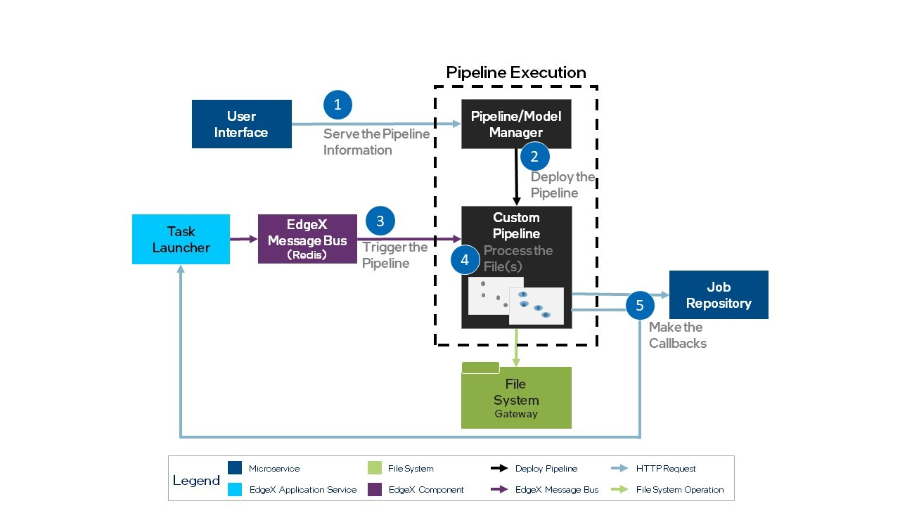

# Pipeline Creation

Use the steps and interface descriptions in this section to integrate a custom pipeline implementation in AiCSD.

## Overview
The reference implementation provides an example pipeline for pipeline management. To understand the position of the pipeline execution component within the AiCSD architecture, see Figure 1 in the [Overview](../index.md). Integration of a new pipeline involves connecting services and communicating through the interfaces described in the following sections. 

Communication between the pipeline and the reference implementation occurs through both the EdgeX Message Bus using Redis Pub/Sub and REST calls.
The EdgeX Message Bus is implemented using a configurable secure Redis Pub/Sub messaging system. 
The current solution also exposes messages published on the EdgeX Message Bus using a non-secure MQTT broker.
To share information between services, the reference implementation uses the concept of a **Job**, a data structure containing metadata about the input file and its related output file(s). 

!!! Note
    To learn more about how the reference implementation services work, see [Image Processing](../services/general-info.md#image-processing).
    For more information about the **Tasks** and **Jobs** concept, see [Interface Basics](../getting-started/ms-web-ui-guide.md#interface-basics).

The Table below lists the implementation steps and requirements for pipeline integration. For an illustration of the steps and services involved, see Figure 1. 


| Step                             | Requirement Description                                                                                                                     | Note  | 
|:--------------------------------------|---------------------------------------------------------------------------------------------------------------------------------------------|----------------------------|
| [**1. Serve the Pipeline Information**](#serve-the-pipeline-information) | The reference implementation UI issues a REST call to obtain the pipeline information served at a REST endpoint.                            | The custom pipeline must serve from the REST endpoint, `api/v1/pipelines`.|
| [**2. Deploy the Pipeline**](../pipelines/bentoml/deploy-bentos.md) | The Pipeline/Model Manager (ie BentoML) deploys the custom pipelines.                                                                                    |  [**Developer Guide for Bentos**](../pipelines/bentoml/developer-guide-bentos.md)|
| [**3. Trigger (start) the Pipeline**](#start-the-pipeline)| The Task Launcher publishes an event to the EdgeX Message Bus on the specified topic to trigger the Custom Pipeline.                         | The Custom Pipeline uses the Job information in the data structure.  |
| [**4. Process the Files**](#process-the-input-file) | This aspect of the implementation is highly dependent on the model, custom pipeline details, and the overall use case of an implementation. | Typically, it generates an output file. |
| [**5. Make the Callbacks**](#callbacks-from-the-pipeline) | The custom pipeline sends information to the reference implementation Task Manager via REST.                                                | This is a two-step process involving updating the Job Repository and notifying the Task Launcher. |

<figure class="figure-image">

<figcaption>Figure 1: Pipeline Integration</figcaption>
</figure>

See the interface details in the following sections.

## Serve the Pipeline Information
 
**PORT:** 10107

**ENDPOINT:** `api/v1/pipelines`

**HTTP METHOD:** GET

**DESCRIPTION:** provides information that aids in setting up Tasks and assigning Jobs to a particular pipeline

**BODY:** application/json

```json
{
    {
      "Id": string,
      "Name": string,
      "Description": string,
      "SubscriptionTopic": string,
      "Status": string,
    },
    {
      // repeat for each pipeline
    }
}
```

## Start the Pipeline

**PROTOCOL:** Redis or MQTT Message Broker

**TOPIC:** specified by the task (should correspond to topic the pipeline subscribes to)

**DESCRIPTION:** provides the Job structure to the pipeline via the EdgeX Message Bus

**BODY:** application/json

```json
{
  "InputFileLocation": string,
  "OutputFileFolder": string,
  "ModelParams": map[string]string,
  // the URLs here will already be specific to the job with the necessary parameters filled in
  "JobUpdateUrl": string,
  "PipelineStatusUrl": string
}
```

## Process the Input File

File processing is highly dependent on the model, custom pipeline details, and use case of the implementation.

## Callbacks from the Pipeline

When the pipeline has completed its operations, it will make two calls to send the following information back to the reference implementation.

### Job Repository Update

**ENDPOINT (to call):** `JobUpdateUrl` value from the EdgeX Message Bus payload UI

**HTTP METHOD:** PUT

**DESCRIPTION:** updates the job metadata with the pipeline status, quality control flags, output files, and/or results from the pipeline

**BODY:** application/json
    ```json
    {
        "Status" : "PipelineComplete", // or "PipelineFailed"
        "QCFlags" : "Quality Control string, can be empty", 
        "OutputFiles" : "[
                          {
                          "DirName": "/path/to/file",
                          "Name": "file_name.extension",
                          "Extension": "file extension without the .",
                          "Status": "current status - can be empty",
                          "ErrorDetails": "detailed error message- can be empty",
                          "Owner": "current owner - can be empty"
                          },
                          {
                          // repeat as necessary
                          }], 
        "Results" : "any results string to be displayed in the AiCSD UI"
    }
    ```

### Task Launcher Pipeline Status

!!! Note
    Notify the reference implementation of the Pipeline Status **after** calling [Job Repository Update](#job-repository-update).

**ENDPOINT (to call):** `PipelineStatusUrl` value from the EdgeX Message Bus payload

**HTTP METHOD:** POST

**CONTENT TYPE:** `text/plain`

**DESCRIPTION:** notifies the reference implementation of the Pipeline Status

**BODY CONTENTS:** `PipelineComplete` or `PipelineFailed`

BSD-3 License: See [License](../LICENSE.md).
