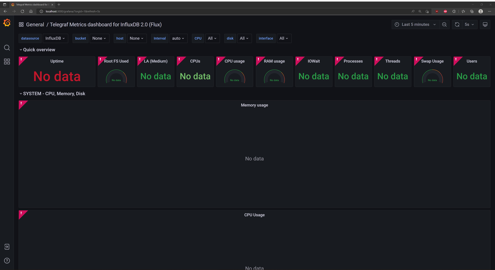

# Troubleshooting

## General

| Error or Issue          | Possible Solution       | 
|:---------------------|-----------------------|
| Update the .env file | If there are issues seeing service and container logs within the Kibana UI or the system health data on the Grafana dashboard, verify the contents of .env file. To verify the password and token necessary for authentication, refer to the setup steps in [Run the Services](monitoring/overview.md#run-the-services). | 
| Check logs | To check the logs for Telegraf, InfluxDB, and/or Grafana, see [Check Logs](getting-started/troubleshooting.md#check-logs) |

## Authentication Issues

| Error or Issue          | Possible Solution       | 
|:---------------------|-----------------------|
| Grafana dashboard not appearing | If there are issues seeing system health data on the default Grafana dashboard, check the .env file. To verify the password and token necessary for authentication, refer to the setup steps in [Run the Services](monitoring/overview.md#run-the-services). | 
| InfluxDB Error Log - `Error: failed to setup instance: password is too short`|  InfluxDB user passwords must contain at least 8 characters. If there is a password issue, the error on the left will appear in the error log for InfluxDB. |

## Grafana UI Connection
| Error or Issue          | Possible Solution       | 
|:---------------------|-----------------------|
| No data message in Grafana UI | The error illustrated by the figure below indicates the UI has a token authorization problem. To verify, see [Check Logs](getting-started/troubleshooting.md#check-logs). The InfluxDB Error Log will contain `error="token required", error="authorization not found"`. To fix, see [Reset Authorization Header](#reset-authorization-header). |

## Kibana UI Connection
| Error or Issue          | Possible Solution       | 
|:---------------------|-----------------------|
| Kibana Error Message: `Kibana server is not ready yet`. | There may be an issue with the setup time for Kibana. Give the services a little longer to finish the setup process and try refreshing the page. |

## Docker Startup Sequence
| Error or Issue          | Possible Solution       | 
|:---------------------|-----------------------|
`|[outputs.influxdb_v2] When writing to [http://influxdb:8086]: Post "http://influxdb:8086/api/v2/write?bucket=systemHealthMonitoring&org=AiCSD": dial tcp 172.26.0.2:8086: connect: connection refused` | `Telegraf` may start before `InfluxDB` is ready for connections. This can lead to the error message on the left in the error log.  If the error appears only once and does **not** repeat several times, disregard the error log.|

## Reset Authorization Header

1. Click on the **Sign in** button on the bottom of the Grafana UI nav bar on the left. Sign in with **user: admin** and **password: admin**. 

2. Change the default admin password to something other than admin. The Grafana UI will prompt for a new password. 
3. Click on the gear wheel in the left nav bar and go to **Data Sources.** 
4. Click on InfluxDB. 
5. Under the **Custom HTTP Headers** section, click **Reset.**
6. In the Value section type Token <fill_in_token_from_env_file>, where the <fill_in_token_from_env_file> is the token update in the .env file. Be sure to put the space between the Token prefix and your actual token.
7. Click **Save & test** and refresh the browser.

This series of steps resets the Authorization header to enable Grafana to access data for the dashboards.

BSD 3-Clause License: See [License](LICENSE.md).